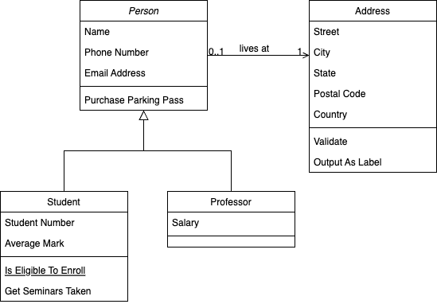

# testSheet-MVVM
- MVVM 이해를 위한 예제 코드 작성
- 구조
  - View(변경 예정)
    - UIPickerView를 활용하여 animalType과 age를 선택한 후, Label에 출력
    - ViewModel의 Model에서 변경이 발생할 경우, ViewController에서 View를 직접 변경
  - ViewModel(작성 예정): UIPickerView에서 선택한 데이터를 전달받아 가지고 있는 Model 변경
  - Model(작성 예정): animal의 정보를 담는 모델(CoreData활용).

